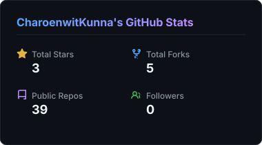
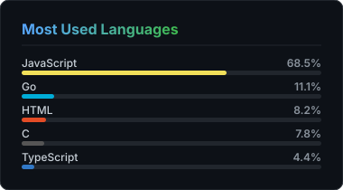

# Charoenwit Kunna

### Independent developer making games, tools, and experiments

> I build browser games, automation tools, game backends, and networking projects. Most of my work starts as a small experiment and grows from there.

## What I build

| 🎮 Play | ⚙️ Automate | 🌐 Connect |
|:---:|:---:|:---:|
| Browser games and prototypes | Bots, APIs, scrapers, and self-hosted tools | Multiplayer systems, mesh services, and server tools |

## Featured projects

<table>
  <tr>
    <td width="50%">
      <h3>🪐 <a href="https://github.com/CharoenwitKunna/Sticky-Orbit">Sticky-Orbit</a></h3>
      
A physics-based browser game with a global leaderboard. Easy to start, harder to master.

    </td>
    <td width="50%">
      <h3>🧩 <a href="https://github.com/CharoenwitKunna/infinite-maze-td">Infinite Maze TD</a></h3>
      
An endless maze tower-defense game with a new path to defend each run.

    </td>
  </tr>
  <tr>
    <td width="50%">
      <h3>🎯 <a href="https://github.com/CharoenwitKunna/multiplayer_fps_template">Multiplayer FPS Template</a></h3>
      
A browser multiplayer starter for testing real-time gameplay.

    </td>
    <td width="50%">
      <h3>🤖 <a href="https://github.com/CharoenwitKunna/EconomyBot">EconomyBot</a></h3>
      
A 24/7 game economy bot built for deployment on Railway and live communities.

    </td>
  </tr>
</table>

<strong>More projects</strong> (click to open)

 

- 🧠 [flashmaths](https://github.com/CharoenwitKunna/flashmaths): speed-focused math practice
- ✍️ [typeflow](https://github.com/CharoenwitKunna/typeflow): a typing flow app in TypeScript
- 📺 [youtube_title_editer](https://github.com/CharoenwitKunna/youtube_title_editer): automatic YouTube title updates
- 🛡️ [ai-act-starter](https://github.com/CharoenwitKunna/ai-act-starter): an EU AI Act compliance starter
- 🛰️ [DrednotServer_Econ](https://github.com/CharoenwitKunna/DrednotServer_Econ): an economy layer for game servers

## Tools I use

## GitHub activity

  
  

<strong>What I’m working on</strong>

 

- Game prototypes that are quick to learn and fun to replay
- Small services that run without a huge stack
- Better ways to make automation feel natural to use

## Get in touch

Have a browser game idea, an automation problem, or a systems challenge? [Open an issue](https://github.com/CharoenwitKunna/CharoenwitKunna/issues) or [connect on LinkedIn](https://www.linkedin.com/in/charoenwitkunna).

*I’m usually building something, testing something, or learning how to make it better.* ✨

